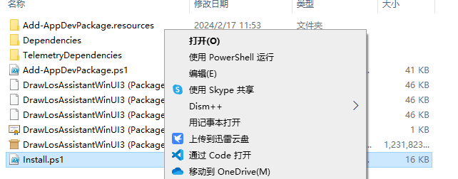

# 抽签助手
高自定义程度的抽签软件

## 功能

普通的抽签（走普通名单）

带有普通, Rare, Super Rare三个等级的抽卡

高自定义程度抽卡

名单锁定

## 安装
### 前置条件
1. Windows 10版本至少为1809
2. [软件本体](https://github.com/MineTestGaming/DrawLosAssistantWinUI3/releases)
### 自动安装(初次)

打开设置 -> 更新和安全 -> 开发者选项，打开`从任意源（包括松散文件〕安装应用`

右键`Install.ps1`，点击`使用 PowerShell 运行`
安装完成

### 手动安装/更新
#### 安装证书 （仅第一次安装）
打开release包附带的.cer证书

点击`安装证书`

存储位置选择`本地计算机`

将证书置入`受信任的根证书颁发机构`
#### 安装本体
点开msixbundle包，然后直接像安装一般应用一样安装即可